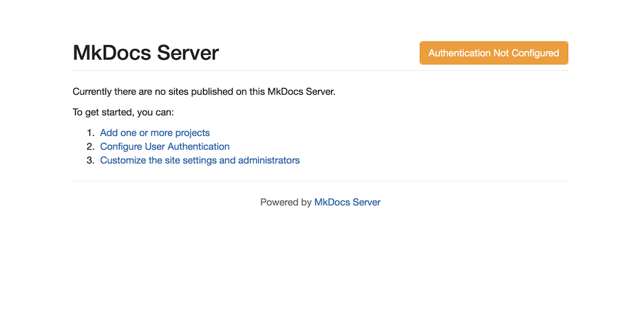
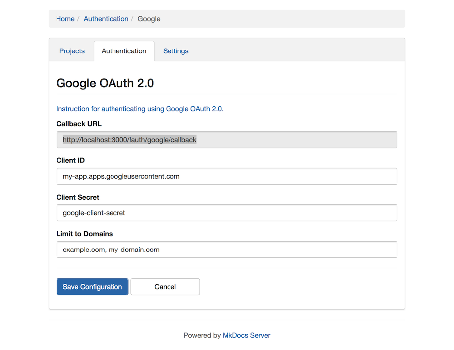
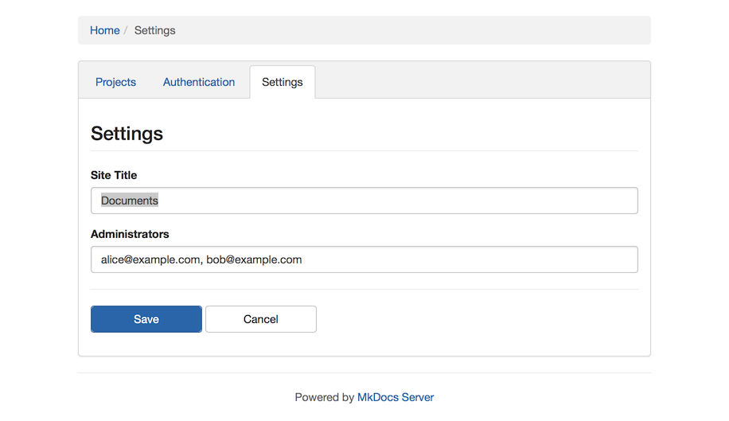
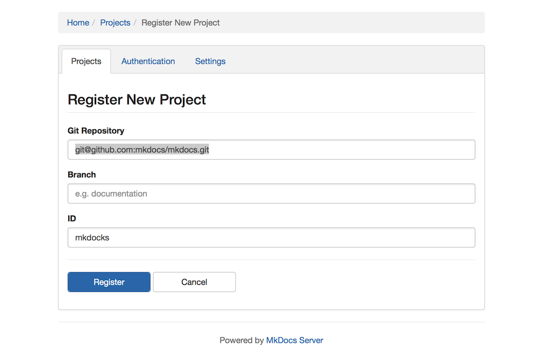
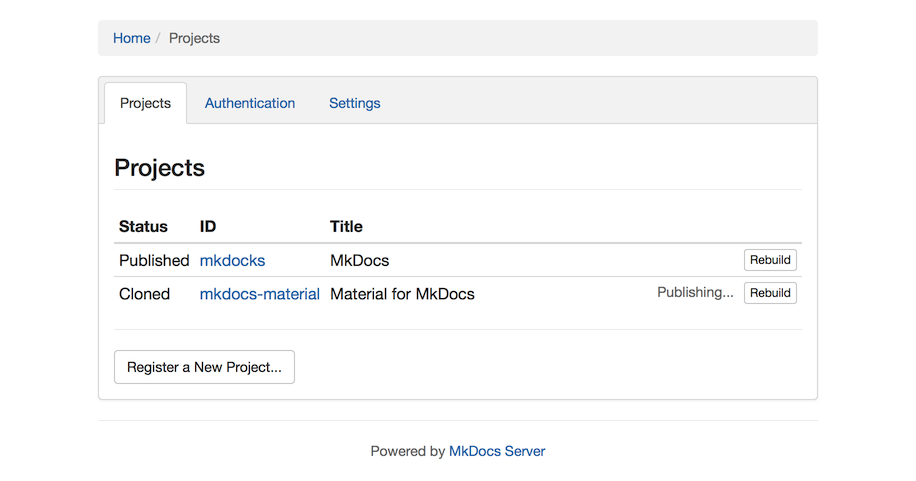
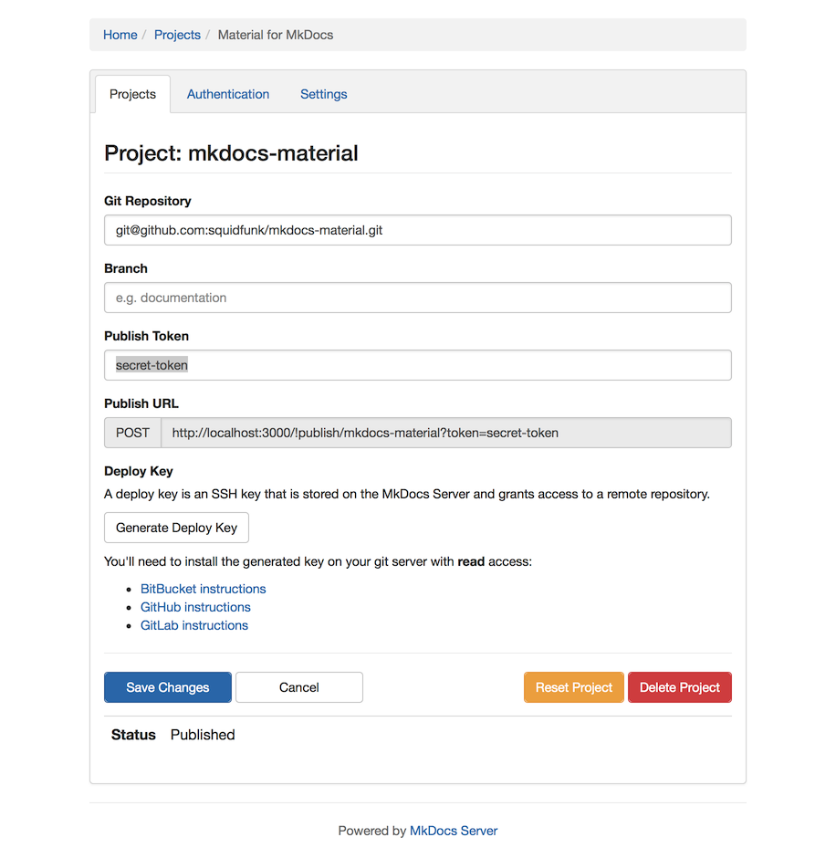

# Configuration

When the server is installed and running, the browser shows the following initial screen:

| Initial Home Page |
| ---- |
|  |

## Authentication

The Authentication configuration allows you to require users to log in
with a 3rd party password befor accessing the MkDocs Server.

| Configuration for Google OAuth 2.0 |
| ---- |
|  |

MkDocs Server leverages OAuth 2.0 authentication.  You have to configure
a client application in your OAuth provider and supply the corresponding
Client ID and Client Secret.

Some authentication configurations allow you to restrict the authenticated users.
For example, Google authentication allows you to restrict access to users
from one or more GSuite domain.

## Settings

The *Site Title* allow you to specify the header text displayed on the home page.

| Settings Configuration |
| ---- |
|  |

The *Administrators* setting allows you to list the email addresses that have
access to the configurations.

If you leave this setting blank, any authenticated user will be able to change configurations.

## Projects

### Registering new Projects

The *Projects* configuration allows you to add new projects.

| Registering a new project |
| ---- |
|  |

The *Git Repository* settings contains the URL to the repository wher the MkDocs source is located.
Re repository should have a `mkdocs.yaml` file in its root directory.

The *Branch* can optionally specify the branch where the documentation is located.

The *ID* will be used in the URL to the generated site.

### Listing Projects

The Projects list shows all registered projects.

| List of registered projects |
| ---- |
|  |

The *Status* indicates the state the project is in.
Only _Published_ projects are listed on the home page.

#### Generating Static Sites

On the Project listing, next to each project is a _Rebuild_ button.
Clicking it causes the project to pull down latest changes for its repo and regenerate the static site.

When the server is updating a project, it indicatos so with a "Cloning..." and "Publishing..." message.

### Editing Projects

You can change the configuration of an existing project.

| Configuring an registered project |
| ---- |
|  |

The *Reset Project* button deletes the cloned directory and published site, but keeps the project configuration.

The *Delete Project* button deletes everything on disk and unregisters the project.

#### Publish Token

The project's static site be automatically generated by issuing a POST command to a project-specific URL.

To enable automatic publishing, you must specify a non-empty _Publish Token_, usually a random list of characters.

You should then configure your Git provider to send a `POST` request to the _Publish URL_ when code is
pushed to the repository.

#### Deploy Keys

You can use a _Deploy Key_ to allow the MkDocs Server to clone a private repository.

When you click the _Generate Deploy Key_ button, an authentication key is generated on the server.
The public deploy key must be be installed on your Git server in order for the MkDocs Server to authenticate.

